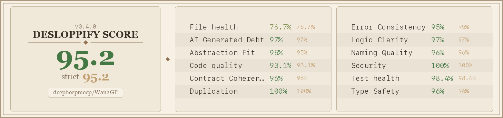

# Reigh-Worker

GPU worker for [Reigh](https://github.com/banodoco/Reigh) — processes video generation tasks using [Wan2GP](https://github.com/deepbeepmeep/Wan2GP).

## Quick Start

```bash
# 1. Create venv
python3 -m venv venv && source venv/bin/activate

# 2. Install dependencies
pip install -r Wan2GP/requirements.txt
pip install -r requirements.txt

# 3. Run worker
SUPABASE_SERVICE_ROLE_KEY="your-key" python worker.py \
    --supabase-url "https://your-project.supabase.co" \
    --worker "my-worker-001"
```

Get credentials from [reigh.art](https://reigh.art/).

## Standalone Usage

Use the generation engine without Reigh for local testing or custom pipelines:

```bash
# Join two video clips with AI-generated transition
python examples/join_clips_example.py \
    --clip1 scene1.mp4 --clip2 scene2.mp4 \
    --output transition.mp4 --prompt "smooth camera glide"

# Regenerate corrupted frames
python examples/inpaint_frames_example.py \
    --video my_video.mp4 --start-frame 45 --end-frame 61 \
    --output fixed.mp4 --prompt "smooth motion"
```

### Using HeadlessTaskQueue Directly

```python
from headless_model_management import HeadlessTaskQueue, GenerationTask
from pathlib import Path

queue = HeadlessTaskQueue(wan_dir=str(Path(__file__).parent / "Wan2GP"), max_workers=1)
queue.start()

task = GenerationTask(
    id="my_task",
    model="wan_2_2_vace_lightning_baseline_2_2_2",
    prompt="a cat walking through a garden",
    parameters={"video_length": 81, "resolution": "896x512", "seed": 42}
)

queue.submit_task(task)
result = queue.wait_for_completion(task.id, timeout=600)
print(f"Output: {result.get('output_path')}" if result.get("success") else f"Error: {result.get('error')}")

queue.stop()
```

## Debugging

```bash
python -m debug task <task_id>          # Investigate a task
python -m debug tasks --status Failed   # List recent failures
```

## Tests

```
tests/test_ltx2_pose_smoke.py       8 passed           Pose extraction + control signal wiring
tests/test_ltx2_headless.py        29 passed           LTX-2 model detection, params, image/audio bridge
tests/test_task_conversion_headless.py  30 passed      DB→GenerationTask pipeline, phase config parsing
tests/test_ic_lora_gpu.py           1 passed, 1 skip   IC-LoRA pose workflow (GPU), union control LoRA
tests/test_ic_lora_gpu.py           1 passed, 1 skip   IC-LoRA union control (GPU)
─────────────────────────────────────────────────────
Total                              69 passed, 2 skipped
```

### Running Tests

```bash
# Headless tests (no GPU required, runs in seconds)
python -m pytest tests/test_ltx2_pose_smoke.py tests/test_ltx2_headless.py tests/test_task_conversion_headless.py -v

# GPU tests (requires GPU + model weights + test media)
# Prerequisites: place vid1.mp4 and img1.png in Wan2GP/ directory
python -m pytest tests/test_ic_lora_gpu.py -v -s

# All tests at once
python -m pytest tests/test_ltx2_pose_smoke.py tests/test_ltx2_headless.py tests/test_task_conversion_headless.py tests/test_ic_lora_gpu.py -v -s
```

## Code Health



## Project Structure

See [STRUCTURE.md](STRUCTURE.md) for detailed project layout.

## LTX-2 Integration Status

LTX-2 19B has been integrated into the worker alongside the existing Wan 2.2 pipeline. Below is the current status of each integration phase.

### Phase 1 — LTX-2 + Upstream Wan2GP Updates ✅ Complete

| Component | Status | Location |
|-----------|--------|----------|
| LTX-2 model detection (`_is_ltx2()`) | ✅ | `source/models/wgp/orchestrator.py` |
| LTX-2 generation path | ✅ | WGP generate_video pattern |
| Model loading (`ltx2_19B`) | ✅ | WGP generate_video pattern |
| Worker task routing (`ltx2` task type) | ✅ | `source/task_types.py` → `ltx2_19B` |
| HeadlessTaskQueue routing | ✅ | `source/task_registry.py` |
| Upstream WGP v10.83 synced | ✅ | Handler, defaults, configs present |
| GPU test passed | ✅ | 168s generation, video output verified |

### Phase 1b — Testing & Validation ✅ Complete (69 passed, 2 skipped)

All headless + GPU tests passing. See [Test Results](#test-results) above for breakdown.

### Phase 2 — Image Anchoring + Audio-Driven Video ✅ Complete

| Feature | Status | Location |
|---------|--------|----------|
| `start_image` → `image_start` (PIL) bridging | ✅ | `source/models/wgp/orchestrator.py` |
| `end_image` → `image_end` (PIL) bridging | ✅ | `source/models/wgp/orchestrator.py` |
| `audio_input` → `audio_guide` bridging | ✅ | `source/models/wgp/orchestrator.py` |
| `image_prompt_type` auto-detect (T/TS/TE/TSE) | ✅ | `source/models/wgp/orchestrator.py` |
| Audio encoding/conditioning in LTX-2 | ✅ | `Wan2GP/models/ltx2/ltx2.py` |
| Travel segment image/audio passthrough | ✅ | `source/task_handlers/travel_between_images.py` |

### Phase 3 — Wan vs LTX-2 Toggle ✅ Complete

| Feature | Status | Location |
|---------|--------|----------|
| `use_ltx2` flag in orchestrator payload | ✅ | `source/task_handlers/travel_between_images.py` |
| Model selection (`ltx2_19B` vs Wan) | ✅ | `source/task_handlers/travel_between_images.py` |
| Segment dependency chain (LTX-2 sequential) | ✅ | `source/task_handlers/travel_between_images.py` |
| Task type → model mapping | ✅ | `source/task_types.py` |
| Worker dispatch routing | ✅ | `source/task_registry.py` |

### Phase 4 — IC-LoRA Pose Control ✅ Complete

| Feature | Status | Location |
|---------|--------|----------|
| IC-LoRA pose control LoRA loading | ✅ | `Wan2GP/defaults/ltx2_19B.json` preload_URLs |
| IC-LoRA depth control LoRA | ✅ | `Wan2GP/defaults/ltx2_19B.json` preload_URLs |
| IC-LoRA canny control LoRA | ✅ | `Wan2GP/defaults/ltx2_19B.json` preload_URLs |
| IC-LoRA union control LoRA | ✅ | `Wan2GP/defaults/ltx2_19B.json` preload_URLs |
| Distilled LoRA (speed/quality) | ✅ | `Wan2GP/defaults/ltx2_19B.json` loras |
| Pose workflow GPU-verified | ✅ | Tested with MediaPipe pose extraction + video guide |

### Bug Fixes (Post-Merge)

Several bugs were discovered and fixed after the v10.83 + LTX-2 merge:

| Bug | Root Cause | Fix |
|-----|-----------|-----|
| `apply_changes` import error | Merge conflict brought back deleted API; upstream replaced `apply_changes` with `get_default_settings` + `set_model_settings` | Replaced import and call site in `orchestrator.py` |
| Missing v10.x WGP parameters | 12 new parameters (`alt_prompt`, `duration_seconds`, `audio_scale`, `self_refiner_*`, etc.) not passed to `generate_video()` | Added to both passthrough and normal mode in `wgp_params.py` |
| Union control LoRA 404 | Wrong filename in `ltx2_19B.json` (missing `-ref0.5` suffix) | Corrected URL to `ltx-2-19b-ic-lora-union-control-ref0.5.safetensors` |
| `NoneType / int` crash in control_net_weight2 | Default values only set inside `if is_vace:` block; LTX-2 is not VACE | Moved defaults outside the VACE-specific block |
| Test searching wrong file | `test_new_params_present_in_headless_wgp` only checked `orchestrator.py` after params were refactored to `wgp_params.py` | Updated test to search both files |

### IC-LoRA Pipeline Status

The IC-LoRA control weights (pose, depth, canny, union) load correctly as LoRA adapters. However, the specialized `ICLoraPipeline` (with reference downscale and video conditioning guide injection, equivalent to ComfyUI's `LTXICLoRALoaderModelOnly` + `LTXAddVideoICLoRAGuide` nodes) is **not yet active** — the config defaults to the `two_stage` pipeline.

To activate the full IC-LoRA pipeline, add `"ltx2_pipeline": "ic_lora"` to the model definition in `Wan2GP/defaults/ltx2_19B.json`. This would enable:
- Reference frame downscale factor control
- Video conditioning guide injection into the diffusion process
- Two-stage generation with IC-LoRA-specific conditioning

### Remaining Gaps

1. **Wan 2.2 baseline test** — No test exists to confirm existing Wan generation behavior is unchanged after integration.
2. **HeadlessTaskQueue integration test** — The production path (queue → task conversion → orchestrator) has no end-to-end test coverage.
3. **IC-LoRA pipeline activation** — `ICLoraPipeline` is available but not enabled by default (see above).

## Powered By

[Wan2GP](https://github.com/deepbeepmeep/Wan2GP) by [deepbeepmeep](https://github.com/deepbeepmeep) — the `Wan2GP/` directory contains the upstream engine.
